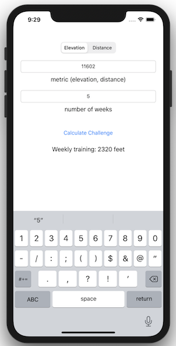

# ChallengeCalculator

ChallengeCalculator introduces unit tests and test driven development (TDD). ChallengeCalculator is a simple training challenge calculator that lets the user see training per week given a distance or elevation challenge.



#### Unit Tests 

```swift 
  func testCalculateWeeklyTraining() {
    // arrange
    let sut = Challenge() // creating an instance of Challenge
    let sutExpectedAverage = 2320 // feet elevation per week
    let metric = 11_602 // overall elevation challenge
    let numberOfWeeksForChallenge = 5 // weeks
    
    // act
    let weeklyTraining = sut.calculateWeeklyTraining(for: Double(metric), and: numberOfWeeksForChallenge)
    
    // assert
    XCTAssertEqual(sutExpectedAverage, weeklyTraining, "\(weeklyTraining) should be equal to \(sutExpectedAverage)")
  }
  
  func testDivisionBy0ReturnsNegativeOne() {
    // arrange
    let sut = Challenge()
    let metric: Double = 11_602
    let numberOfWeeksForChallenge = 0
    let expectedOutput = -1
    
    // act
    let sutOutput = sut.calculateWeeklyTraining(for: metric, and: numberOfWeeksForChallenge)
    
    // assert
    XCTAssertEqual(sutOutput, expectedOutput)
  }
  
  
  // TDD - Test driven developement:
  /*
   You start off writing a unit test until it fails (or a compiler error), then go to production code e.g Challenge.swift file,
   fix the failure until the test passes, continue writing unit test until failure again and continue the cycle
  */
  func testAverageDailyMetric() {
    // arrange
    let sut = Challenge()
    let sutWeeklyTotalMetric = 2320 // total elevation
    let expectedDailyAverage = 773 // elevation per day
    let numberOfWorkoutDays = 3 // days
    
    // act
    // averageTrainingPerWeek expects to return 773
    let averageDailyTraining = sut.averageTrainingPerWeek(challengeMetric: sutWeeklyTotalMetric, numberOfWorkoutDays: numberOfWorkoutDays)
    
    // assert
    XCTAssertEqual(averageDailyTraining, expectedDailyAverage, "\(averageDailyTraining) should be equal to \(expectedDailyAverage)")
  }
```
